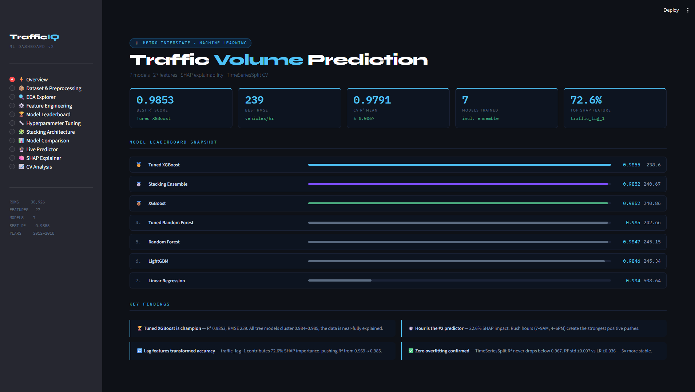

# 🚦 Traffic Volume Prediction using Machine Learning

🚀 **R² Score:** 0.9853 (Tuned XGBoost)
📊 **7 Models + Stacking Ensemble**
🧠 **Explainable AI (SHAP)**
📈 **Interactive Streamlit Dashboard**

---

## 📸 Dashboard Preview

> Add your screenshots in `/assets` and update paths below



---

## 📌 Overview

This project predicts **hourly traffic volume** on a metro interstate highway using historical weather and temporal data. It demonstrates a complete ML pipeline: preprocessing → feature engineering → modeling → evaluation → explainability → deployment (Streamlit).

---

## 🚀 Highlights

* 7 ML models: Linear, RF, Tuned RF, XGBoost, Tuned XGBoost, LightGBM, Stacking
* Feature engineering: **9 → 27 features** (lag, rolling, interactions)
* **Time-series split** (no leakage) + TimeSeriesSplit CV
* **SHAP** for global & local explanations
* Production-style **Streamlit app** for EDA, comparison & live prediction

---

## 🏆 Model Performance

| Model               | R²         | RMSE |
| ------------------- | ---------- | ---- |
| ⭐ Tuned XGBoost     | **0.9853** | 239  |
| Stacking Ensemble   | 0.9852     | 240  |
| XGBoost             | 0.9851     | 241  |
| Tuned Random Forest | 0.9850     | 242  |
| Random Forest       | 0.9847     | 245  |
| LightGBM            | 0.9846     | 245  |
| Linear Regression   | 0.9340     | 508  |

---

## 🧠 Key Insights (SHAP)

* **Lag features dominate (~68%)** → last hour’s traffic is the strongest signal
* **Hour of day** is the 2nd strongest driver (rush hours)
* **Weather impact is minimal (<5%)**
* Feature engineering contributed more than hyperparameter tuning

---

## ⚙️ Pipeline

1. Data cleaning (NaN, duplicates, datetime parsing)
2. Segment-aware **lag features** (no cross-gap leakage)
3. **Rolling statistics** (mean, std, max)
4. Categorical encoding & interactions
5. Train/Test split (2012–16 / 2017–18)
6. Train 7 models + stacking
7. Evaluate (R², RMSE, MAE) + TimeSeries CV
8. Explain with SHAP
9. Visualize & serve via Streamlit

---

## 📊 Dataset

* Source: UCI Metro Interstate Traffic Volume
* Rows: 48,204 → 38,926 (after preprocessing)
* Frequency: Hourly (2012–2018)
* Target: `traffic_volume`

---

## 🛠 Tech Stack

* Python, Pandas, NumPy
* Scikit-learn
* XGBoost, LightGBM
* SHAP
* Plotly, Matplotlib
* Streamlit

---

## 📁 Project Structure

```
.
├── Metro_Interstate_Traffic_Volume.csv   # Dataset
├── traffic_dashboard_v3.py               # Streamlit app
├── requirements.txt                     # Dependencies (add this)
├── assets/                              # Images (add screenshots)
├── .gitignore
└── README.md
```

---

## ▶️ Run Locally

```bash
git clone https://github.com/manavshah409/Traffic_Vol_Predictor.git
cd Traffic_Vol_Predictor
pip install -r requirements.txt
streamlit run traffic_dashboard_v3.py
```

---

## ⚠️ Limitations

* Large time gaps require segment-based features
* Single-highway dataset (limited generalization)
* No future weather forecasts used

---

## 🔮 Future Work

* LSTM / Transformer models for long-term dependencies
* Real-time weather API integration
* Multi-road spatial modeling
* FastAPI deployment + endpoints
* Prediction uncertainty (conformal intervals)

---

## ⭐ Support

If you found this useful, consider giving a ⭐ and sharing feedback!
